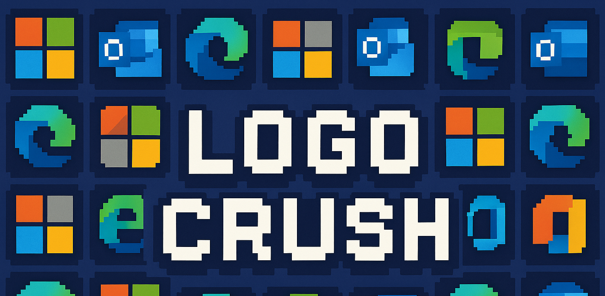

# LogoCrush 🎮



A Microsoft cloud logo match-3 puzzle game, inspired by Candy Crush. 154 product logos, no install, no dependencies.

## 🎮 Play Now

**[Play LogoCrush →](https://logocrush.andrasfordos.com/)**

## How to Play

1. Pick a **"Your Cloud"** filter — choose a Microsoft product category (Azure, Business Applications, Modern Workplace, …) or play with all logos
2. **Swap** adjacent tiles by dragging (mobile) or clicking (desktop)
3. **Match 3 or more** identical logos in a row or column to clear them
4. **Combos** earn bonus score multipliers — the longer the chain, the higher the reward
5. Hit the **score target** before either moves or time run out to advance to the next level
6. **Special tiles** — see the table below for how to create them and what they do
7. Use the **💡 Hint** button if you're stuck — it highlights a valid move
8. From **3500** logos matched, unlock **Clippy** as a side-panel hint assistant

Your **best score** and **best level** are saved locally. Share your stats directly to LinkedIn from the start screen.

## ✨ Special Tiles

| Tile | Appearance | How to create | Effect |
|------|-----------|---------------|--------|
| 🟠 **Golden** | Orange radial glow | Drops randomly (3 % chance) when new tiles fall in | Clears all 8 surrounding neighbours (3 × 3 minus itself) |
| 🟥🟨 **Striped — row** | Horizontal red / yellow stripes | Match **4** in a horizontal line | Clears the entire **row** |
| 🟨🟥 **Striped — column** | Vertical yellow / red stripes | Match **4** in a vertical line | Clears the entire **column** |
| 💎 **Shiny** | Blue-white crystal glow | Match **5+** in an L, T, or + shape | Clears every copy of that logo from the whole board |

## 📦 Repository Structure

```
index.html        — complete game (single file, no build step, no dependencies)
manifest.json     — icon registry with metadata and tags
/icons/           — SVG logo files (one per Microsoft product or version)
/assets/          — PNG icons (Copilot family) and static images (banner, Clippy)
CONTRIBUTING.md   — how to add new icons
NOTICE.md         — project and trademark notice
```

## 🤝 Contributing Icons

See [CONTRIBUTING.md](CONTRIBUTING.md) for the full guide on adding Microsoft product SVG icons via pull request.

## 📊 Analytics

This site uses [hits.sh](https://hits.sh/) for cookieless, privacy-friendly visit counting. No personal data is collected or stored.

## 📄 License

[AGPL v3](LICENSE) — see [NOTICE.md](NOTICE.md) for trademark information.
